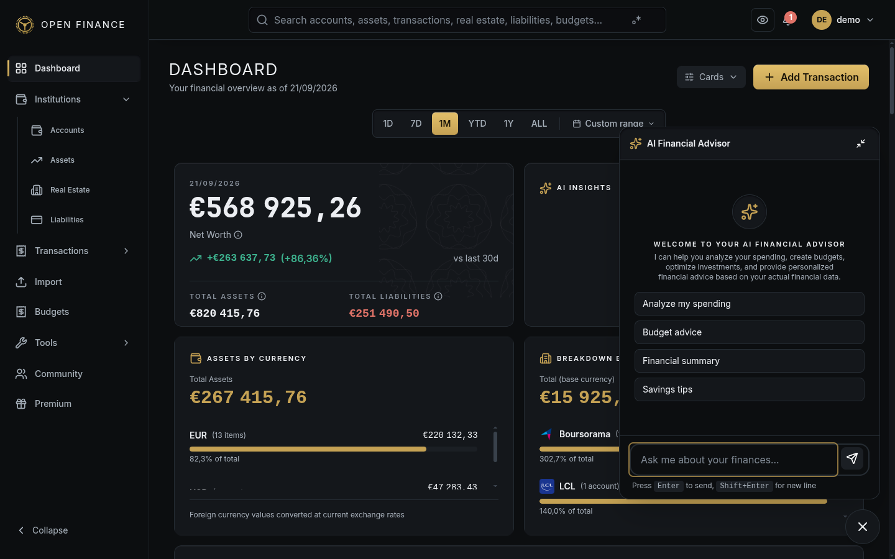

# AI Assistant

← [Wiki Home](HOME.md)

---

## Overview

The AI Assistant is a conversational interface for asking natural language questions about your finances. It uses your actual financial data — accounts, transactions, budgets, assets — as context, so answers are specific to your situation.

**Go to:** the floating assistant button (bottom-right) on any page.

---

## Getting Started

Navigate to **AI Assistant** in the main menu. You can start a new conversation or pick up where you left off in a previous one.

Example questions you can ask:

- “How much did I spend on restaurants last month?”
- “Am I on track with my grocery budget?”
- “What’s my net worth trend over the last 6 months?”
- “Which category had the highest spending in March?”

---

## AI Providers

Open-Finance supports two AI backends:

| Provider              | Description                                                                                                         |
| --------------------- | ------------------------------------------------------------------------------------------------------------------- |
| **Ollama (local)**    | Runs entirely on your device — no data leaves your machine. This is the default.                                    |
| **OpenAI (optional)** | Uses OpenAI’s API for potentially better answers. When enabled, a summary of your financial data is sent to OpenAI. |

The active provider is configured by your administrator. See [Security Features](security-features.md) for privacy considerations when using OpenAI.

---

## Conversations

Each chat session is stored as a separate conversation. You can maintain multiple independent conversations — for example, one for retirement planning and another for monthly budget analysis.

- **Create a new conversation:** click **New Conversation** and give it a title.
- **Switch conversations:** select one from the conversation list on the left.
- **Delete a conversation:** open it and click the delete icon.

---

## What the Assistant Knows

Before answering your question, the assistant automatically retrieves and uses:

- Your total assets, liabilities, and net worth
- Your last 30 days of transactions (summarised by category)
- Your active budgets and their current progress
- Your currency and locale settings

This means you never need to paste or explain your data — the assistant already has the context it needs.

---

## Privacy

When using the default **Ollama** provider, all processing happens locally on your server — no financial data is sent anywhere externally. When using **OpenAI**, a financial summary is transmitted to OpenAI’s servers. The choice of provider is set during installation.

---

## Related Pages

- [Financial Insights](insights.md)
- [Anomaly Detection](anomaly-detection.md)
- [Security Features](security-features.md)
