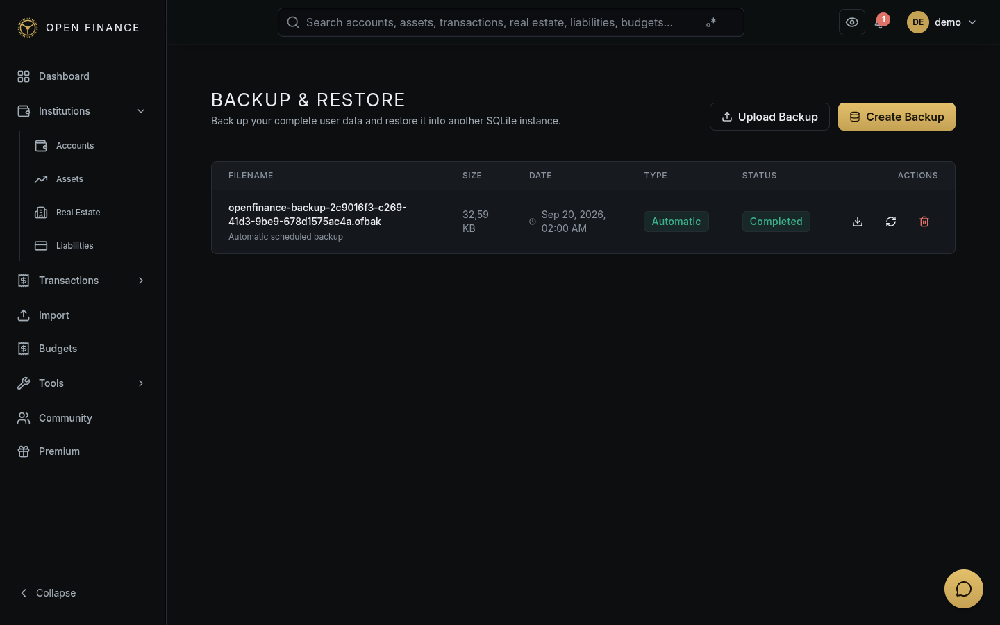

# Backup & Restore

← [Wiki Home](HOME.md)

---

## Overview

Open-Finance generates encrypted backup archives of your entire database. Backups can be created manually, restored in-place, or downloaded for off-device storage.

**Go to:** Settings → Backup (or the Backup page).

---

## Backup File Format

Backups are saved as encrypted `.ofbak` files. Each backup contains:

- A full copy of your database
- A checksum to verify data integrity
- Metadata (timestamp, app version)

The backup is encrypted using your **master password** — it cannot be opened or restored without it.

---

## Backup Types

| Type      | How it’s triggered                          |
| --------- | ------------------------------------------- |
| Manual    | You initiate it from the Backup page        |
| Automatic | Runs on a weekly schedule in the background |

Automatic backups keep the last 5 backup files by default. Manual backups are never automatically deleted.

---

## Creating a Manual Backup

Go to **Settings → Backup → Create Backup**. You can optionally add a description (e.g., “Before major import”) to help identify the backup later.

---

## Downloading a Backup

From the backup list, click **Download** next to any backup to save the `.ofbak` file to your device. Store it somewhere safe, such as a cloud drive or external storage.

---

## Restoring from an Existing Backup

From the backup list, click **Restore** next to the backup you want to use.

> ⚠️ **All data created after the backup date will be lost.** If you want to keep your current state, create a new backup first.

The restore process verifies the checksum and decrypts the archive using your master password before applying it.

---

## Restoring from an Uploaded File

If you have a `.ofbak` file from another device:

1. Go to **Settings → Backup → Restore from File**.
2. Upload your `.ofbak` file.
3. Open-Finance verifies the file and restores your data.

---

## Related Pages

- [Security Features](security-features.md)
- [Import & Export](import-export.md)
- [Settings & Profile](settings.md)
