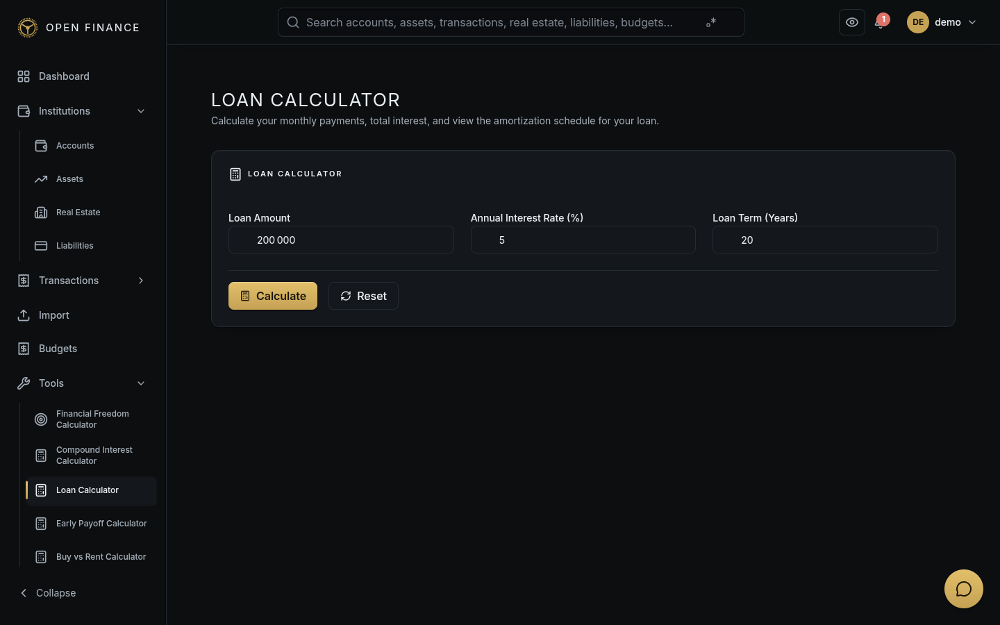
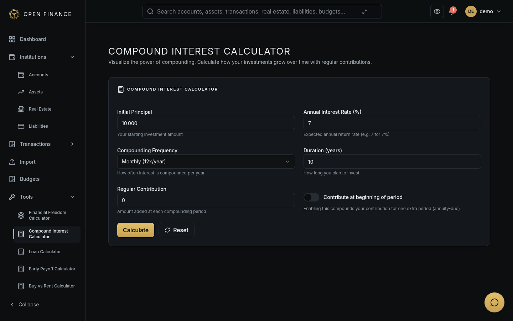
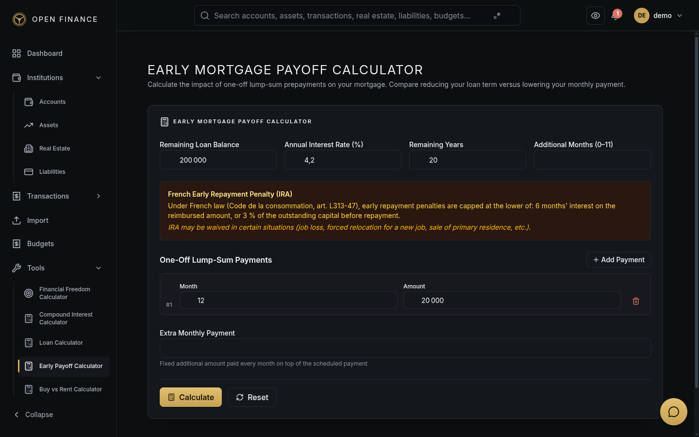
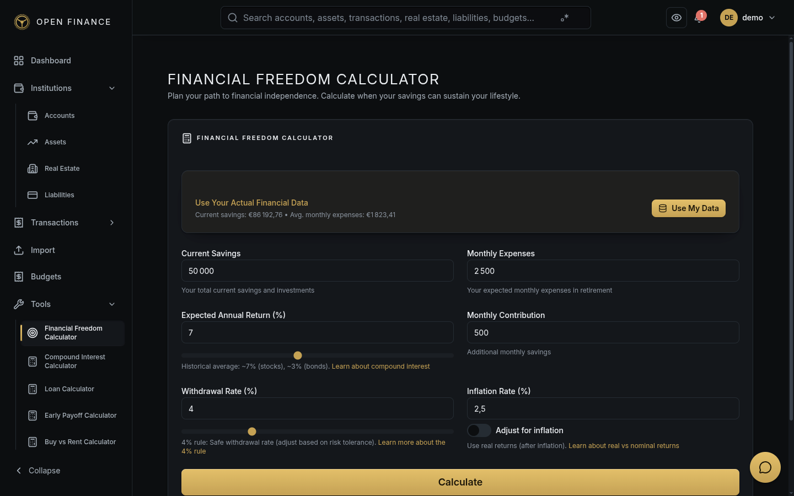

# Financial Calculators

← [Wiki Home](HOME.md)

---

## Overview

Open-Finance includes four standalone financial calculators accessible from the **Tools** menu. They can be used for planning purposes before committing to any financial decision and do not require any account data.

---

## Loan Calculator

Model any fixed-rate instalment loan.

**Go to:** Tools → Loan Calculator

### Inputs

| Field                      | Description            |
| -------------------------- | ---------------------- |
| Principal                  | Loan amount            |
| Annual Interest Rate       | % per year             |
| Term                       | Duration in months     |
| Additional Monthly Payment | Optional extra payment |

### Outputs

| Output                | Description                                                  |
| --------------------- | ------------------------------------------------------------ |
| Monthly Payment       | Required minimum payment                                     |
| Total Interest        | Total interest paid over the term                            |
| Total Cost            | Principal + total interest                                   |
| Payoff Date           | Estimated payoff date                                        |
| Amortization Schedule | Month-by-month breakdown of principal vs interest vs balance |

---

## Compound Interest Calculator

Model investment growth with regular contributions and variable compounding frequency.

**Go to:** Tools → Compound Interest

### Inputs

| Field                 | Description                         |
| --------------------- | ----------------------------------- |
| Principal             | Initial investment amount           |
| Annual Rate           | Expected annual return (%)          |
| Compounding Frequency | Daily, Monthly, Quarterly, Annually |
| Years                 | Investment horizon                  |
| Monthly Contribution  | Optional regular deposit            |

### Outputs

| Output                 | Description                          |
| ---------------------- | ------------------------------------ |
| Final Balance          | Total value at the end of the period |
| Total Contributed      | Sum of all contributions             |
| Total Interest Earned  | Balance minus contributions          |
| Year-by-Year Breakdown | Annual snapshots of balance growth   |

---

## Early Payoff Calculator

Calculate the savings from making extra payments on an existing loan.

**Go to:** Tools → Early Payoff

### Inputs

| Field                   | Description                   |
| ----------------------- | ----------------------------- |
| Current Balance         | Remaining principal           |
| Annual Interest Rate    | Current loan rate (%)         |
| Regular Monthly Payment | Your current payment          |
| Extra Monthly Payment   | Additional amount you can pay |

### Outputs

| Output            | Description                                           |
| ----------------- | ----------------------------------------------------- |
| New Payoff Date   | Earlier payoff date with extra payments               |
| Months Saved      | Reduction in loan term                                |
| Interest Saved    | Total interest avoided                                |
| Break-even Period | Time to recover any refinancing costs (if applicable) |

---

## FIRE / Financial Freedom Calculator

Model the path to financial independence using the FIRE (Financial Independence, Retire Early) framework.

**Go to:** Tools → Financial Freedom

### Timeline — How long until you reach financial freedom?

**Inputs:**

| Field                  | Description                                     |
| ---------------------- | ----------------------------------------------- |
| Current Savings        | Total investable assets today                   |
| Monthly Savings        | Amount added each month                         |
| Monthly Expenses       | Projected retirement spending                   |
| Expected Annual Return | Investment return rate (%)                      |
| Inflation Rate         | Annual inflation assumption (%)                 |
| Safe Withdrawal Rate   | % of portfolio withdrawn per year (default 4 %) |

**Outputs:**

| Output               | Description                              |
| -------------------- | ---------------------------------------- |
| FIRE Number          | Required portfolio size (expenses / SWR) |
| Years to Freedom     | Time to reach the FIRE number            |
| Projected Date       | Calendar date of financial independence  |
| Sensitivity Analysis | Range if return rate varies ± 1 %        |

### Longevity — How long will your savings last?

| Output                | Description                       |
| --------------------- | --------------------------------- |
| Will savings deplete? | Whether savings will run out      |
| Years until depletion | If depleting, when                |
| Final balance         | Remaining balance if not depleted |

---

## Related Pages

- [Liabilities](liabilities.md)
- [Assets](assets.md)
- [Dashboard](dashboard.md)
