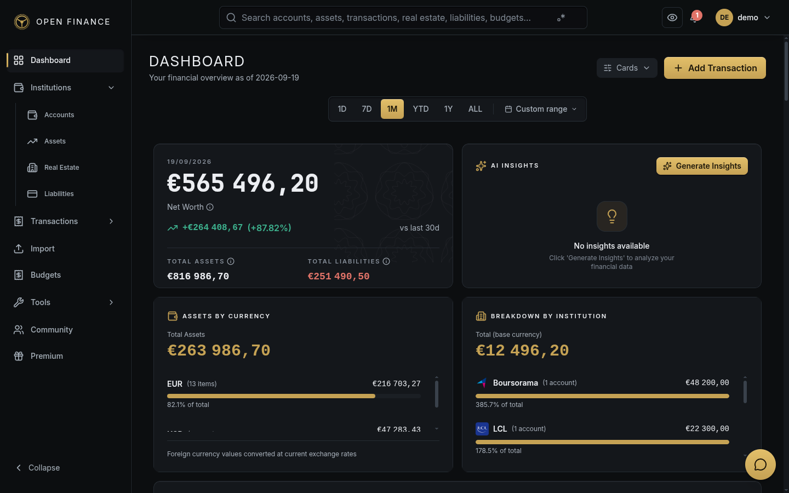
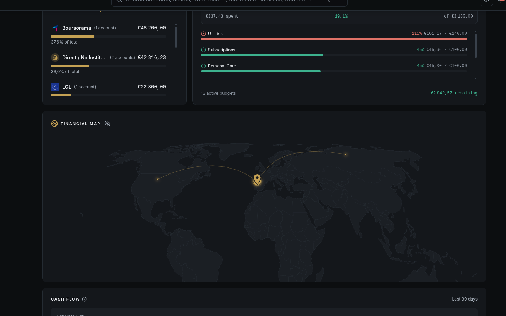

# Dashboard

← [Wiki Home](HOME.md)

---

## Overview

The Dashboard is the central view in Open-Finance. It brings together your accounts, assets, liabilities, budgets, and transactions into a set of widgets that give you an instant snapshot of your financial situation.

---

## Financial Summary

At the top of the Dashboard you’ll find your key figures:

| Metric              | What it shows                                |
| ------------------- | -------------------------------------------- |
| Total Assets        | Sum of all your asset values                 |
| Total Liabilities   | Sum of all outstanding debts                 |
| Net Worth           | Assets minus liabilities                     |
| Net Worth Change    | How your net worth has changed recently      |
| Recent Transactions | Your latest transactions across all accounts |
| Account Summaries   | Per-account balance and recent activity      |

---

## Dashboard Widgets

### Net Worth Over Time

A trend line chart showing your daily net worth over a selected date range. Open-Finance captures a snapshot of your net worth every day, so you can see exactly how it has evolved.

### Cash Flow Analysis

Shows income vs. expenses for a selected period:

- Total income
- Total expenses
- Net cash flow (income minus expenses)
- Monthly breakdown chart

### Spending Breakdown

A pie or donut chart of spending grouped by top-level category, sorted by amount. Quickly see where your money is going this month.

### Asset Allocation

Breaks down your portfolio by asset type (stocks, bonds, crypto, etc.) with percentages and absolute values in your base currency.

### Portfolio Performance

Shows time-weighted and money-weighted returns for your investment portfolio over a selected period.

### Net Worth Allocation

Breaks your net worth into its components:

- Cash & bank accounts
- Investments (stocks, ETFs, crypto, etc.)
- Real estate (net equity)
- Other assets
- Liabilities (shown as a negative)

### Cash Flow Sankey Diagram

A Sankey diagram showing where your money comes from and where it goes — from income sources down through spending categories.

### Borrowing Capacity

An estimate of how much additional borrowing you could take on based on your income, existing repayments, and a debt-to-income ratio.

### Estimated Annual Interest

Total projected interest payable across all your active liabilities for the current year.

### Financial Map

A world map showing where your holdings are located, aggregated by country from your institutions (account balances grouped by each institution's country) and your real estate (properties placed by offline reverse-geocoding of their coordinates, falling back to the address when coordinates are missing). Each country gets a pin sized by the amount held there, your own country (from General settings) is marked with a distinct marker with lines connecting it to each finance location, and hovering a pin shows that country's breakdown. The toggleable legend totals institutions, real estate, and everything combined in your base currency.

### Finance News

A locale-aware RSS feed — English sources for the English UI, French sources for French — showing the latest finance headlines (see [Financial News](news.md)). Clicking a headline opens its summary with a Read Full Article link, each item can be discarded individually, and the Refresh button fetches the latest headlines.

### Assets by Currency

Groups accounts with positive balances by currency, adds assets not linked to an account, and converts foreign currencies to your base currency at current exchange rates, with a progress bar showing each currency's share of the total. Clicking a currency row opens the [Assets](assets.md) page filtered to that currency.

### Breakdown by Institution

Totals your accounts, assets, and liabilities (subtracted) per institution, showing each institution's logo, account count, and share of the total in your base currency. Clicking an institution opens the [Accounts](accounts.md) page filtered to it. A warning appears when some foreign-currency balances lack exchange rates and are excluded.

### Yearly Balance Variation

A year-over-year chart of your net worth from your first transaction year to the most recent, switchable between bar and line views and between total net worth, individual accounts, or institutions. An average yearly change summary sits above the chart, with per-year cards below showing each year's total and variation percentage.

### AI Insights

Shows your top 3 AI-generated insights with priority badges (see [Financial Insights](insights.md)). Clicking an insight opens its full description and each one can be dismissed. When no insights exist, the Generate Insights button analyses your data to create fresh recommendations; once insights exist, Refresh regenerates them.

### Daily Cash Flow

A month calendar where each day shows income (green) and expense (red) bars scaled to the month's maximum, with a tooltip breaking down income, expenses, and net for that day. Clicking a day opens the [Transactions](transactions.md) page filtered to that date; month arrows and a Today button navigate the calendar.

---

## Currency Conversion

All monetary amounts on the Dashboard are automatically converted to your **base currency** using daily exchange rates. You can change your base currency in [Settings](settings.md).

---

## Related Pages

- [Accounts](accounts.md)
- [Assets](assets.md)
- [Liabilities](liabilities.md)
- [Real Estate](real-estate.md)
- [Budgets](budgets.md)
- [Market Data](market-data.md)
