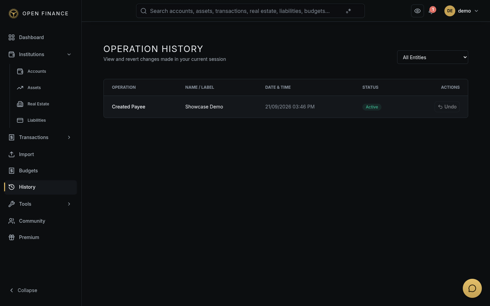

# Operation History & Undo/Redo

← [Wiki Home](HOME.md)

---

## Overview

The Operation History system records every create, update, and delete action you perform. This provides a full audit trail of changes and enables you to undo or redo recent operations.

**Go to:** History in the sidebar.

---

## What Is Recorded

| What you changed       | Operations tracked             |
| ---------------------- | ------------------------------ |
| Transactions           | Create, Update, Delete, Split  |
| Accounts               | Create, Update, Delete, Close  |
| Budgets                | Create, Update, Delete         |
| Assets                 | Create, Update, Delete         |
| Liabilities            | Create, Update, Delete         |
| Real Estate            | Create, Update, Delete         |
| Categories             | Create, Update, Delete         |
| Payees                 | Create, Update, Delete         |
| Recurring Transactions | Create, Update, Delete         |
| Transaction Rules      | Create, Update, Delete, Toggle |
| Import Sessions        | Confirm                        |

Each history record includes what changed, the previous and new values, the timestamp, and a human-readable summary (e.g., “Updated transaction #42: amount changed from $50 to $65”).

---

## Viewing History

Go to **Settings → History** (or the history icon in the navigation bar) to browse past operations. You can filter by:

- Record type (transactions, accounts, budgets…)
- Operation type (create, update, delete)
- Date range

---

## Undo

To undo a recent action, find it in the history list and click **Undo**. This reverses the change by restoring the previous state.

**Constraints:**

- Only the **most recent** operation on a given record can be undone.
- Delete operations can be undone (the record is restored) if no dependent records were created after the deletion.
- Operations older than **30 days** are no longer eligible for undo.

---

## Redo

After undoing an action, click **Redo** to re-apply the undone change.

---

## Related Pages

- [Transactions](transactions.md)
- [Accounts](accounts.md)
- [Security Features](security-features.md)
