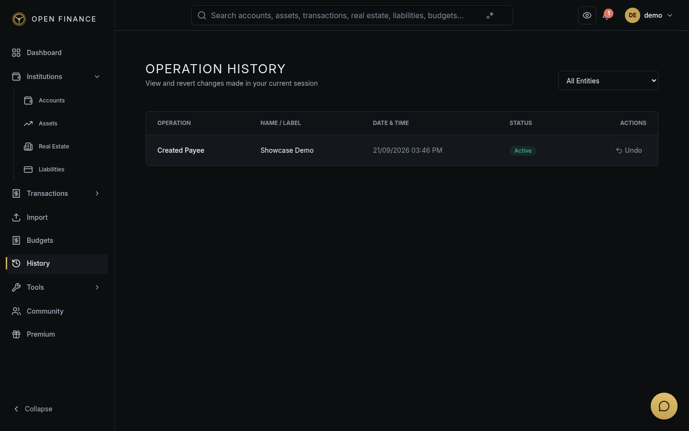

# Operation History & Undo/Redo

← [Wiki Home](HOME.md)

---

## Overview

Operation History records supported financial changes across sessions. New actions include the saved state needed to undo and redo their financial effects together. Older entries remain visible but cannot be reversed when that saved state is missing.

**Go to:** History in the sidebar.

---

## What Is Recorded

| What you changed       | Operations tracked             |
| ---------------------- | ------------------------------ |
| Transactions           | Create, Update, Delete, Split, Transfer edits |
| Accounts               | Create, Update, Delete, Close, Reopen |
| Budgets                | Create, Update, Delete         |
| Assets                 | Create, Update, Delete         |
| Liabilities            | Create, Update, Delete, Draws, Tranches, Financing links |
| Real Estate            | Create, Update, Delete         |
| Categories             | Create, Update, Delete         |
| Payees                 | Create, Update, Delete         |
| Recurring Transactions | Create, Update, Delete, Pause, Resume, Post occurrence |
| Transaction Rules      | Create, Update, Delete, Toggle |
| Import Sessions        | Confirm                        |

Each entry identifies the operation, record, time, and status. **Show changes** displays the principal record's changed values. The record count indicates when related changes belong to the same action. Transfers, balance adjustments, property mirrors, and import confirmations are reversed as a whole.

Attachment uploads/deletions, institution management, permanent purges, backup restoration, security changes, and external market refreshes are outside this undo list. When a supported deletion removes attachments, its undo restores their saved contents. Later attachment or relationship changes can prevent reversal of their parent record.

---

## Viewing History

Go to **History** in the sidebar to browse past operations, including earlier sessions. You can filter by:

- Record type (transactions, accounts, budgets…)
- Operation type (create, update, delete)
- Date range

---

## Undo

To undo a recent action, find it in the history list and click **Undo**. This reverses the change by restoring the previous state.

**Constraints:**

- Later changes affecting the same records must be undone first. Unrelated payments on the same account can remain: undo adjusts the balance by the action's original booked amount.
- Related records, required relationships, and unique names must still permit restoration. A disabled button explains the conflict. The server rechecks before applying the action; errors appear on the page.
- Actions can be undone and redone for **30 days from their original creation**. The age limit does not remove their audit entries.
- Older entries without complete restoration data are read-only.

---

## Redo

After undoing an action, click **Redo** to reapply its saved result, using the same booked amounts, exchange rates, splits, and record identifiers. Undo and redo do not create duplicate history entries.

History is selective, rather than a single global stack. An unrelated new action does not discard all redo choices. An action whose records or dependencies have changed remains unavailable until the conflict is resolved.

Undoing a posted recurring occurrence also restores its previous due date. It can become due again on the next processing run; pause the recurring definition if you want to stop future processing.

---

## Related Pages

- [Transactions](transactions.md)
- [Accounts](accounts.md)
- [Security Features](security-features.md)
