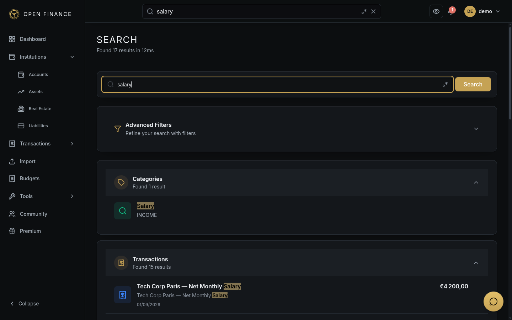

# Global Search

← [Wiki Home](HOME.md)

---

## Overview

The Global Search feature lets you find any financial record — transactions, accounts, assets, liabilities, and real estate properties — from a single search bar. It supports keyword search, advanced filters, and saving frequently used queries.

**Go to:** the search box in the top bar, or the Search page.

---

## Simple Search

Click the search bar at the top of the screen and type a keyword. Results are grouped by type (transactions, accounts, assets, liabilities, properties) and appear instantly.

Example: searching for “Netflix” will return all transactions, payees, and accounts mentioning Netflix.

---

## Advanced Search

Click **Advanced** in the search bar to access structured filters for more precise queries:

| Filter           | Description                                   |
| ---------------- | --------------------------------------------- |
| Keyword          | Full-text search across all records           |
| Record types     | Limit to transactions, accounts, assets, etc. |
| Date range       | Filter transactions by date                   |
| Amount range     | Filter by minimum and maximum amount          |
| Transaction type | Income, expense, or transfer                  |
| Accounts         | Limit to one or more specific accounts        |
| Categories       | Limit to specific categories                  |
| Tags             | Must include all specified tags               |

---

## Saved Searches

Frequently used search queries can be saved and recalled from the search bar dropdown.

- **Save a search:** run a search → click **Save Search** → give it a name.
- **Recall a saved search:** click the search bar → **Saved Searches** dropdown → select an entry. The form is pre-filled and the search re-runs.
- **Delete a saved search:** click the **×** icon next to a saved search in the dropdown.

---

## Search Performance

Transaction descriptions, memos, notes, and payee names are indexed for fast full-text search. This means results appear almost instantly even with large transaction histories.

---

## Related Pages

- [Transactions](transactions.md)
- [Operation History](history.md)
- [Accounts](accounts.md)
