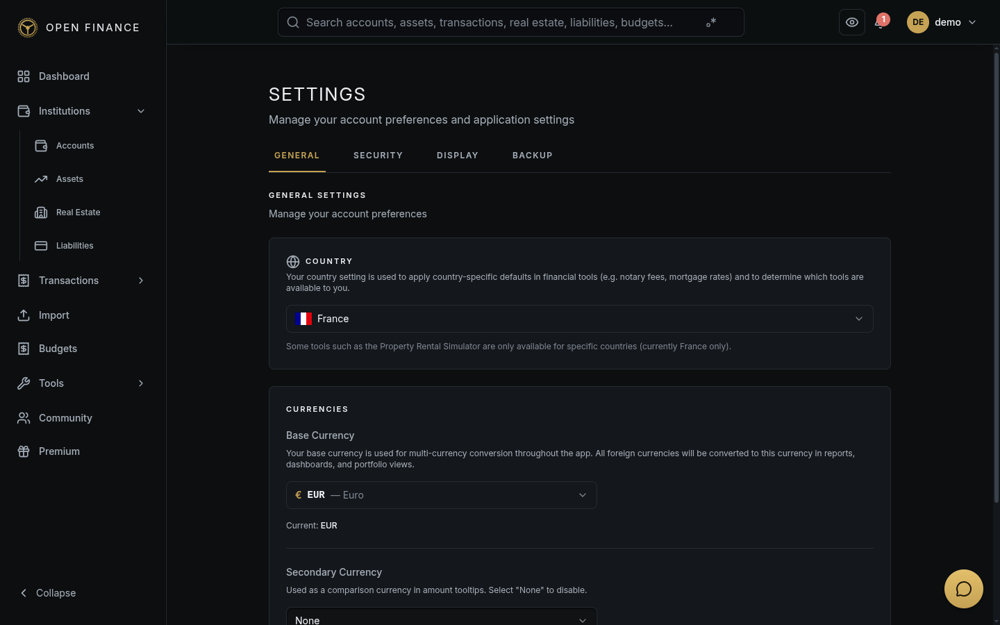

# Settings & Profile

← [Wiki Home](HOME.md)

---

## Overview

The Settings area lets you manage your personal profile, locale preferences, currency configuration, and security credentials.

**Go to:** Settings in the user menu.

---

## Profile

### Display Name & Email

Go to **Settings → Profile** to update your display name or email address.

### Profile Image

Upload a profile picture from **Settings → Profile → Change Photo**. Supported formats: JPEG, PNG, WebP.

### Change Password

Go to **Settings → Security → Change Password**.

Password requirements: at least 8 characters, including uppercase, lowercase, a digit, and a special character.

---

## Currency Settings

| Setting            | Description                                          |
| ------------------ | ---------------------------------------------------- |
| Base Currency      | Primary currency for all totals and reports          |
| Secondary Currency | Optional parallel display currency                   |
| Currency Display   | Symbol position and spacing (before or after amount) |

---

## Locale & Formatting

| Setting             | Options                              |
| ------------------- | ------------------------------------ |
| Language            | English · French                     |
| Date Format         | DD/MM/YYYY · MM/DD/YYYY · YYYY-MM-DD |
| Decimal Separator   | `.` · `,`                            |
| Thousands Separator | `,` · `.` · space                    |
| Country             | Your country of residence            |

---

## Security Settings

### Change Master Password

Go to **Settings → Security → Change Master Password**. This changes the key used to encrypt all your sensitive data. The operation is atomic — if anything goes wrong, your old password remains valid.

### Two-Factor Authentication

Not yet available. Planned for a future release.

---

## Notification Preferences

Control which event types generate in-app notifications:

| Notification type                     | Default |
| ------------------------------------- | ------- |
| Budget alert notifications            | On      |
| Insight notifications                 | On      |
| Anomaly detection notifications       | On      |
| System notifications (backup, import) | On      |

Go to **Settings → Notifications** to adjust these.

---

## Related Pages

- [Onboarding](onboarding.md)
- [Security Features](security-features.md)
- [Backup & Restore](backup-restore.md)
